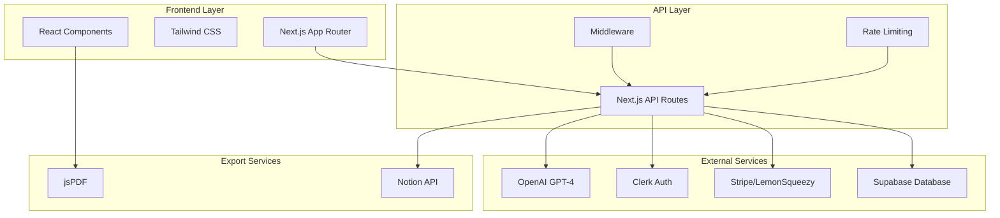

# Design Document

## Overview

TweetToCourse is a Next.js web application that leverages OpenAI's GPT-4 to transform Twitter content into structured educational courses. The system follows a modern JAMstack architecture with server-side rendering, API routes for backend logic, and third-party integrations for authentication, payments, and AI processing.

The application is designed for rapid deployment and scalability, with a focus on user experience and conversion optimization. The architecture supports both free and premium tiers with clear upgrade paths and usage tracking.

## Architecture

### High-Level Architecture



### Technology Stack

**Frontend:**
- Next.js 14+ with App Router for modern React development
- Tailwind CSS for rapid UI development and consistent styling
- TypeScript for type safety and better developer experience
- React Hook Form for form handling and validation

**Backend:**
- Next.js API Routes for serverless backend functionality
- Supabase for database operations and real-time features
- OpenAI API for AI-powered content generation
- Rate limiting middleware for API protection

**Authentication & Payments:**
- Clerk for user authentication and session management
- Stripe or LemonSqueezy for subscription management
- JWT tokens for secure API access

**Export & File Generation:**
- jsPDF for client-side PDF generation
- Notion API for structured content export
- File system API for download handling

## Components and Interfaces

### Core Components

#### 1. Homepage Component (`/`)
- **Purpose:** Landing page with input form and value proposition
- **Props:** None (static content)
- **State:** Input value, loading state, error state
- **Key Features:**
  - Tweet URL validation
  - Manual text input support
  - CTA optimization for conversion

#### 2. Course Generator Component
- **Purpose:** Handles AI processing and result display
- **Props:** Input content, user subscription tier
- **State:** Processing status, generated course data, error handling
- **Key Features:**
  - Loading animation with progress indication
  - Real-time processing status updates
  - Error recovery and retry mechanisms

#### 3. Course Display Component
- **Purpose:** Renders structured course content
- **Props:** Course data, user permissions, export options
- **State:** Edit mode, selected modules, export status
- **Key Features:**
  - Editable course title
  - Module expansion/collapse
  - Export button states based on subscription

#### 4. PDF Export Component
- **Purpose:** Generates and downloads PDF versions
- **Props:** Course data, user tier, branding options
- **State:** Generation progress, download status
- **Key Features:**
  - Watermark logic for free users
  - Custom branding for pro users
  - Progress tracking for large documents

#### 5. Authentication Components
- **Purpose:** User sign-in, sign-up, and account management
- **Integration:** Clerk authentication provider
- **Features:**
  - Social login options
  - Email/password authentication
  - Session persistence and refresh

### API Interfaces

#### 1. Course Generation API (`/api/generate-course`)
```typescript
interface GenerateCourseRequest {
  content: string;
  type: 'url' | 'text';
  userId?: string;
  regenerate?: boolean;
}

interface GenerateCourseResponse {
  success: boolean;
  course?: {
    title: string;
    modules: CourseModule[];
    generatedAt: string;
  };
  error?: string;
  usageCount?: number;
}

interface CourseModule {
  id: string;
  title: string;
  summary: string;
  takeaways: string[];
  order: number;
}
```

#### 2. User Management API (`/api/user`)
```typescript
interface UserProfile {
  id: string;
  email: string;
  subscriptionTier: 'free' | 'pro' | 'lifetime';
  usageCount: number;
  createdAt: string;
  lastActive: string;
}

interface UsageTracking {
  userId: string;
  action: 'generate' | 'export_pdf' | 'export_notion';
  timestamp: string;
  metadata?: Record<string, any>;
}
```

#### 3. Export API (`/api/export`)
```typescript
interface ExportRequest {
  courseId: string;
  format: 'pdf' | 'notion';
  options?: {
    includeWatermark?: boolean;
    customBranding?: boolean;
    notionPageId?: string;
  };
}
```

### Database Schema

#### Users Table
```sql
CREATE TABLE users (
  id UUID PRIMARY KEY DEFAULT gen_random_uuid(),
  clerk_user_id TEXT UNIQUE NOT NULL,
  email TEXT NOT NULL,
  subscription_tier TEXT DEFAULT 'free',
  usage_count INTEGER DEFAULT 0,
  created_at TIMESTAMP DEFAULT NOW(),
  updated_at TIMESTAMP DEFAULT NOW()
);
```

#### Courses Table
```sql
CREATE TABLE courses (
  id UUID PRIMARY KEY DEFAULT gen_random_uuid(),
  user_id UUID REFERENCES users(id),
  title TEXT NOT NULL,
  original_content TEXT NOT NULL,
  modules JSONB NOT NULL,
  created_at TIMESTAMP DEFAULT NOW(),
  updated_at TIMESTAMP DEFAULT NOW()
);
```

#### Usage Logs Table
```sql
CREATE TABLE usage_logs (
  id UUID PRIMARY KEY DEFAULT gen_random_uuid(),
  user_id UUID REFERENCES users(id),
  action TEXT NOT NULL,
  metadata JSONB,
  created_at TIMESTAMP DEFAULT NOW()
);
```

## Data Models

### Course Data Model
The course structure follows a consistent format optimized for both display and export:

```typescript
interface Course {
  id: string;
  title: string;
  description?: string;
  modules: CourseModule[];
  metadata: {
    sourceType: 'tweet' | 'thread' | 'manual';
    sourceUrl?: string;
    generatedAt: string;
    version: number;
  };
}

interface CourseModule {
  id: string;
  title: string;
  summary: string;
  takeaways: string[];
  order: number;
  estimatedReadTime?: number;
}
```

### User Subscription Model
```typescript
interface UserSubscription {
  tier: 'free' | 'pro' | 'lifetime';
  limits: {
    monthlyGenerations: number;
    pdfExports: boolean;
    notionExports: boolean;
    customBranding: boolean;
    watermarkFree: boolean;
  };
  usage: {
    currentMonthGenerations: number;
    totalGenerations: number;
    lastResetDate: string;
  };
}
```

## Error Handling

### Client-Side Error Handling
- **Input Validation:** Real-time validation for tweet URLs and content length
- **Network Errors:** Retry mechanisms with exponential backoff
- **Rate Limiting:** User-friendly messages with upgrade prompts
- **Export Failures:** Fallback options and error recovery

### Server-Side Error Handling
- **OpenAI API Errors:** Graceful degradation and retry logic
- **Database Errors:** Transaction rollbacks and data consistency
- **Authentication Errors:** Secure error messages without information leakage
- **Rate Limiting:** Per-user and per-IP rate limiting with clear messaging

### Error Response Format
```typescript
interface ErrorResponse {
  success: false;
  error: {
    code: string;
    message: string;
    details?: Record<string, any>;
    retryable: boolean;
  };
}
```

## Testing Strategy

### Unit Testing
- **Component Testing:** React Testing Library for UI components
- **API Testing:** Jest for API route testing
- **Utility Testing:** Pure function testing for content processing
- **Mock Services:** OpenAI API mocking for consistent testing

### Integration Testing
- **Authentication Flow:** End-to-end user authentication testing
- **Payment Integration:** Stripe webhook testing and subscription flows
- **Export Functionality:** PDF and Notion export validation
- **Database Operations:** Supabase integration testing

### End-to-End Testing
- **User Journeys:** Complete user flows from input to export
- **Cross-Browser Testing:** Chrome, Firefox, Safari compatibility
- **Mobile Responsiveness:** Touch interactions and mobile layouts
- **Performance Testing:** Load testing for AI processing endpoints

### Testing Tools
- **Jest:** Unit and integration testing framework
- **React Testing Library:** Component testing utilities
- **Playwright:** End-to-end testing automation
- **MSW (Mock Service Worker):** API mocking for tests

## Performance Considerations

### Frontend Optimization
- **Code Splitting:** Dynamic imports for heavy components
- **Image Optimization:** Next.js Image component with WebP support
- **Caching Strategy:** SWR for client-side data fetching
- **Bundle Analysis:** Regular bundle size monitoring

### Backend Optimization
- **API Response Caching:** Redis caching for repeated requests
- **Database Indexing:** Optimized queries for user and course data
- **Rate Limiting:** Prevent abuse while maintaining good UX
- **OpenAI API Optimization:** Request batching and response caching

### Monitoring and Analytics
- **Performance Monitoring:** Core Web Vitals tracking
- **Error Tracking:** Sentry for error monitoring and alerting
- **Usage Analytics:** User behavior tracking for optimization
- **API Monitoring:** Response times and error rates

## Security Considerations

### Authentication Security
- **JWT Validation:** Secure token verification with Clerk
- **Session Management:** Automatic token refresh and secure storage
- **CSRF Protection:** Built-in Next.js CSRF protection
- **Rate Limiting:** Prevent brute force and abuse attempts

### Data Protection
- **Input Sanitization:** XSS prevention for user-generated content
- **SQL Injection Prevention:** Parameterized queries with Supabase
- **API Key Security:** Environment variable management
- **User Data Privacy:** GDPR compliance and data retention policies

### Infrastructure Security
- **HTTPS Enforcement:** SSL/TLS for all communications
- **Environment Isolation:** Separate staging and production environments
- **Dependency Security:** Regular security audits and updates
- **Backup Strategy:** Automated database backups and recovery procedures